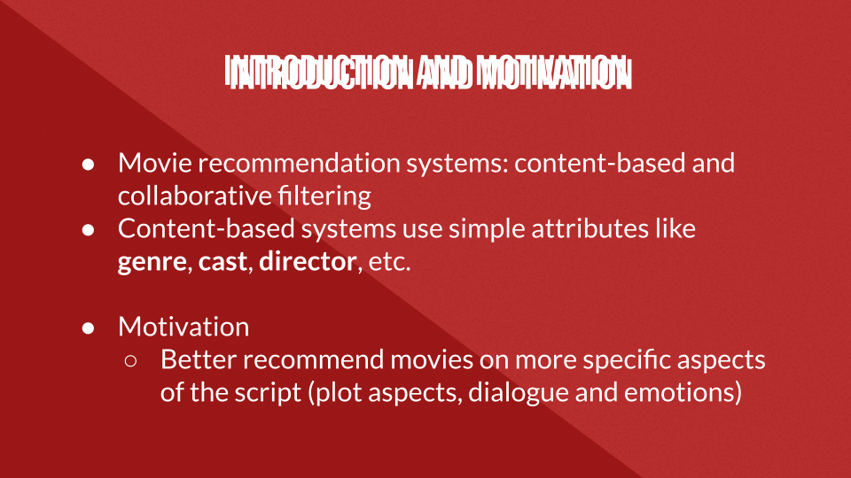
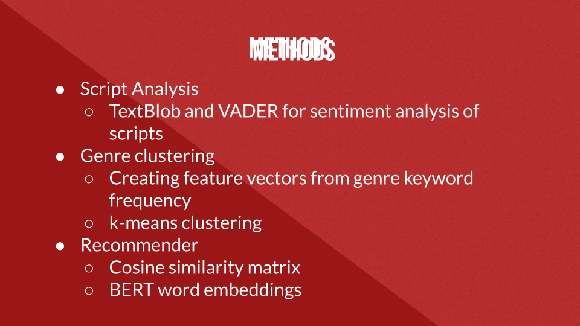

# Welcome!

This repository is a final project for the Princeton course <b>COS 401/TRA 301: Introduction to Machine Translation</b>, and was created by  
Jonny Salama ('22), Tanzila Morshed ('23), and Ryan Gibbons ('24).

Feel free to check out the full <a href="Final Presentation.pdf">slides</a> from our final presentation, or take a look at the rest of the repository
to see our source code for the project!

